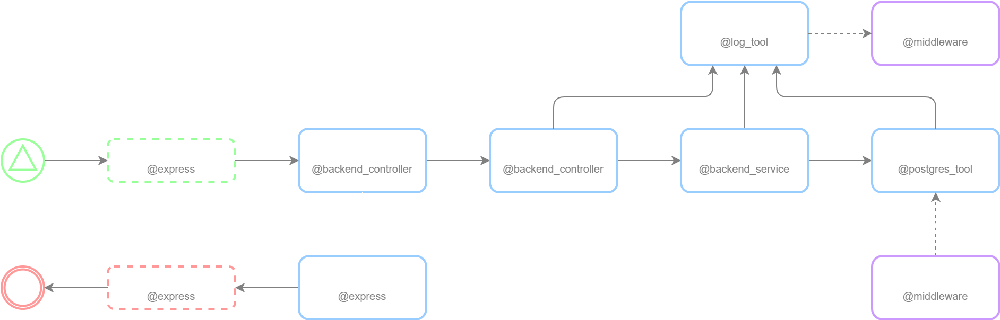
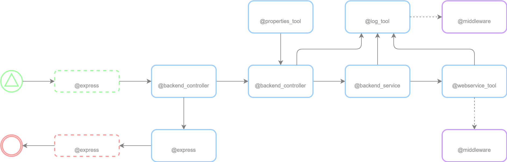
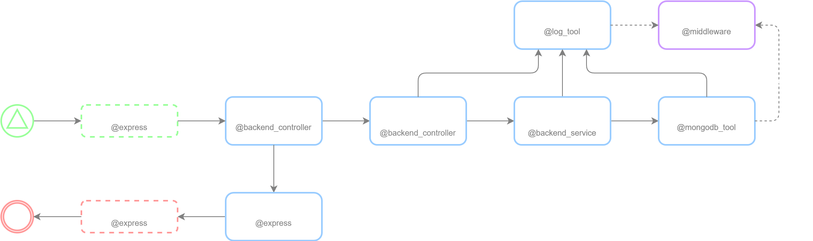
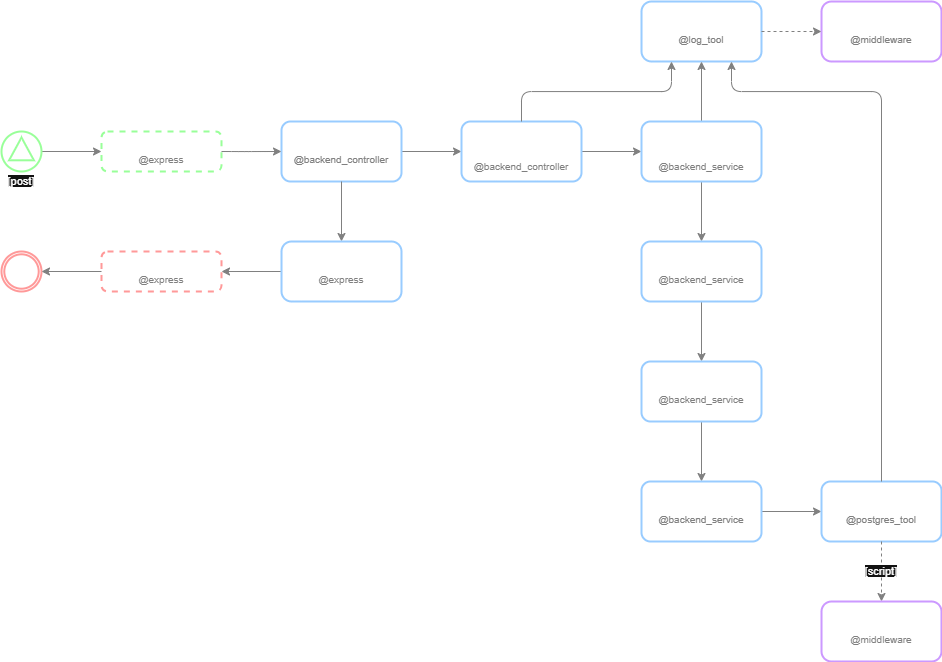
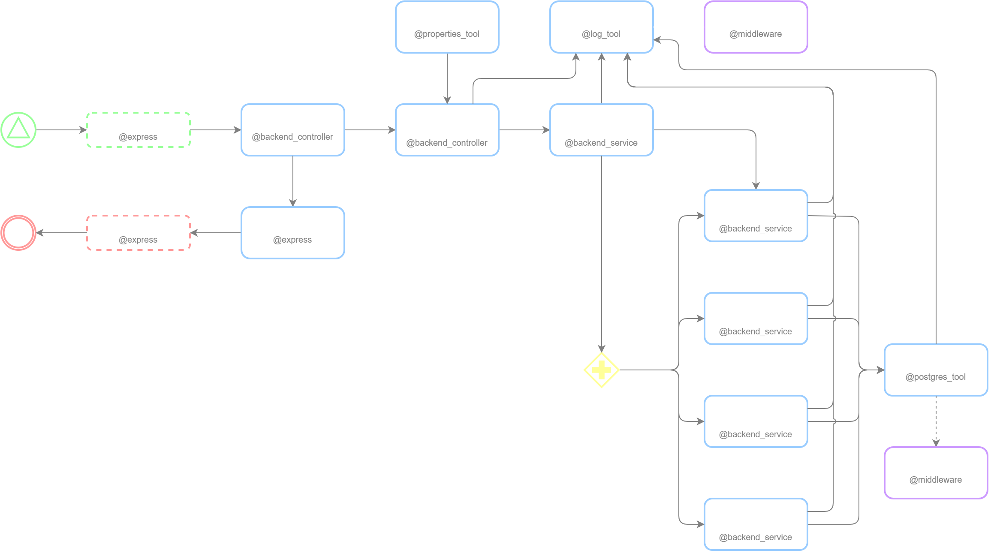

# Backend Endpoints

### Wake Up Action

| ***Category*** | ***Verb*** |     ***Endpoint***     |
|:--------------:|:----------:|:----------------------:|
|    Backend     |    post    | /backend/system/wakeup |

 

### Delete Cache Action

| ***Category*** | ***Verb*** |    ***Endpoint***     |
|:--------------:|:----------:|:---------------------:|
|    Backend     |    post    | /backend/cache/delete |

 

### Rebuild Documental Action

| ***Category*** | ***Verb*** |       ***Endpoint***        |
|:--------------:|:----------:|:---------------------------:|
|    Backend     |    post    | /backend/rebuild/documental |

 

### Rebuild Relational Action

| ***Category*** | ***Verb*** |       ***Endpoint***        |
|:--------------:|:----------:|:---------------------------:|
|    Backend     |    post    | /backend/rebuild/relational |

 

### Reload Indicators Action

| ***Category*** | ***Verb*** |       ***Endpoint***       |
|:--------------:|:----------:|:--------------------------:|
|    Backend     |    post    | /backend/reload/indicators |
