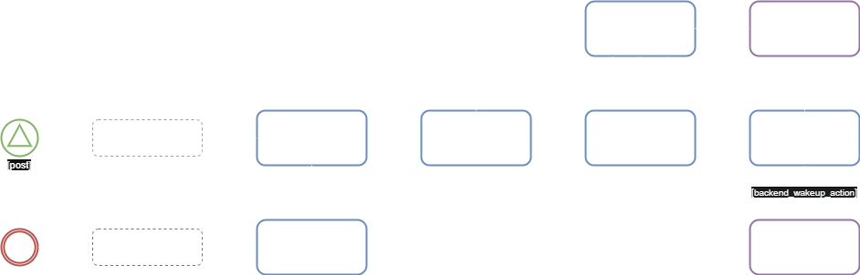
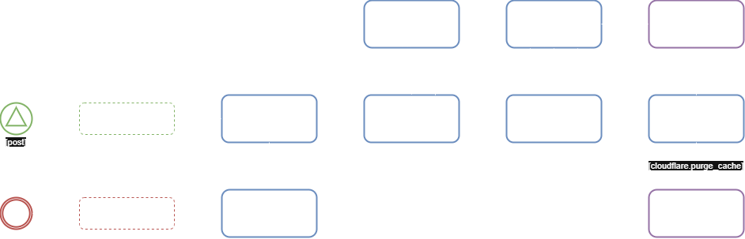
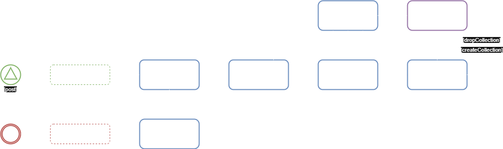
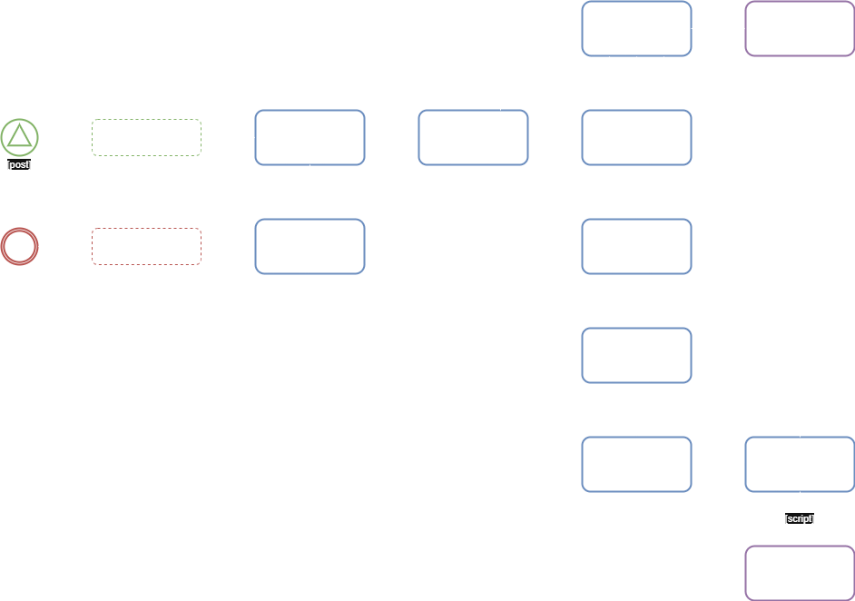
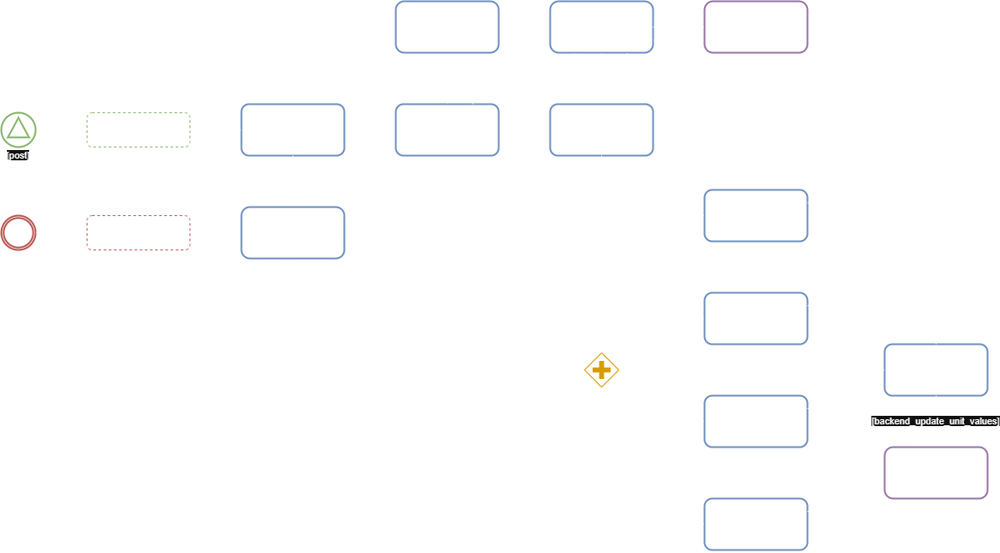

# [Start](../start.md) > Backend Endpoints

 
 
 

> Wake Up Action

|                 ***Layout***                 |
|:--------------------------------------------:|
|  |

| ***Category*** | ***Verb*** |     ***Endpoint***     |
|:--------------:|:----------:|:----------------------:|
|    Backend     |    post    | /backend/system/wakeup |

 
 
 

> Delete Cache Action

|                   ***Layout***                    |
|:-------------------------------------------------:|
|  |

| ***Category*** | ***Verb*** |    ***Endpoint***     |
|:--------------:|:----------:|:---------------------:|
|    Backend     |    post    | /backend/cache/delete |

 
 
 

> Rebuild Documental Action

|                      ***Layout***                       |
|:-------------------------------------------------------:|
|  |

| ***Category*** | ***Verb*** |       ***Endpoint***        |
|:--------------:|:----------:|:---------------------------:|
|    Backend     |    post    | /backend/rebuild/documental |

 
 
 

> Rebuild Relational Action

|                      ***Layout***                       |
|:-------------------------------------------------------:|
|  |

| ***Category*** | ***Verb*** |       ***Endpoint***        |
|:--------------:|:----------:|:---------------------------:|
|    Backend     |    post    | /backend/rebuild/relational |

 
 
 

> Reload Indicators Action

|                  ***Layout***                   |
|:-----------------------------------------------:|
|  |

| ***Category*** | ***Verb*** |       ***Endpoint***       |
|:--------------:|:----------:|:--------------------------:|
|    Backend     |    post    | /backend/reload/indicators |
