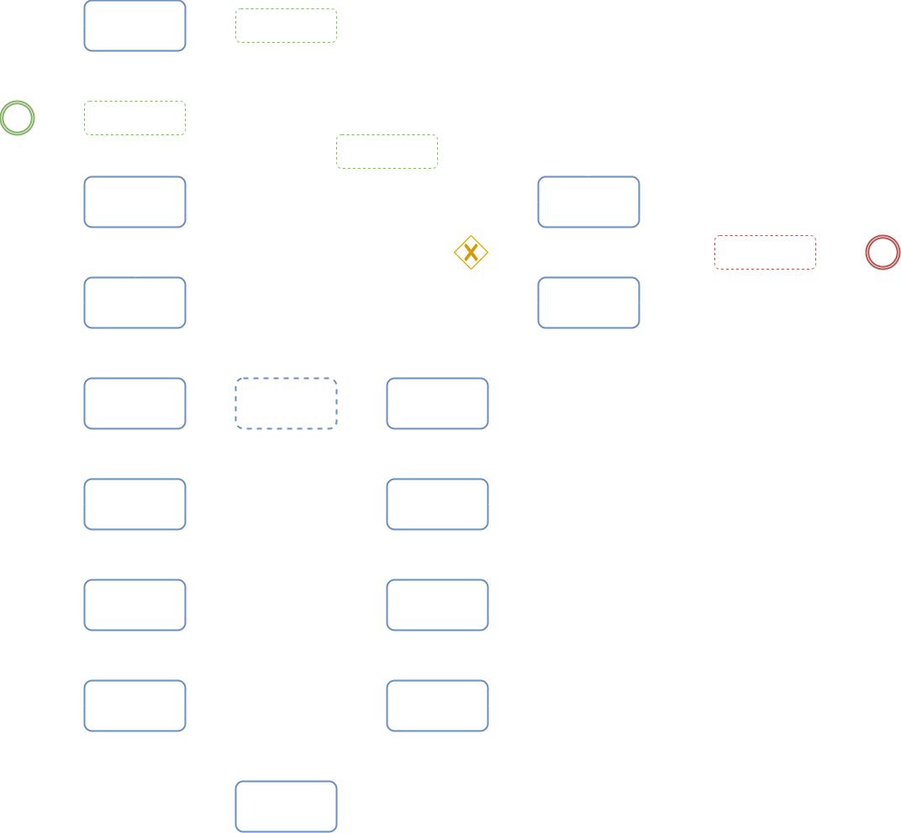
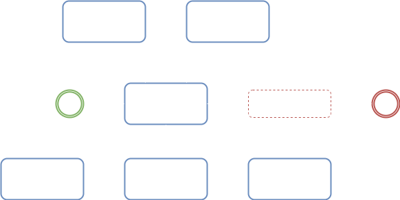
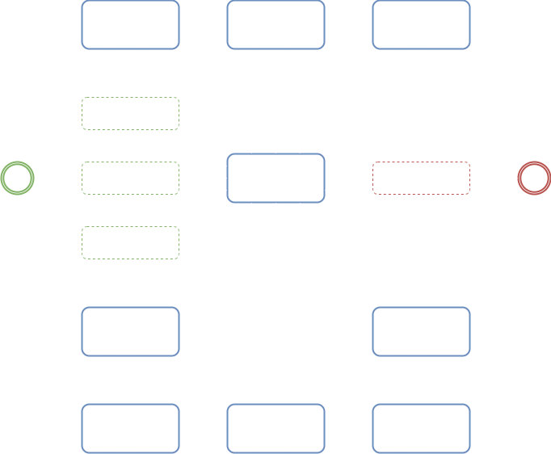
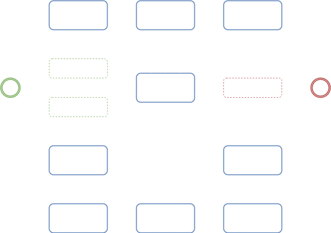

# [Start](../start.md) / Database Layout

 
 
 

> General Layout

|                   ***Layout***                    |
|:-------------------------------------------------:|
|  |

 
 
 

> Status Initializer

|                   ***Layout***                    |
|:-------------------------------------------------:|
|  |

 
 
 

> Result Successfully

|                    ***Layout***                    |
|:--------------------------------------------------:|
|  |

 
 
 

> Result Failed

|                 ***Layout***                 |
|:--------------------------------------------:|
|  |
